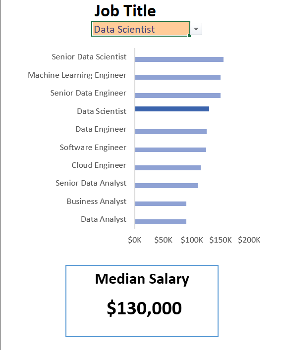
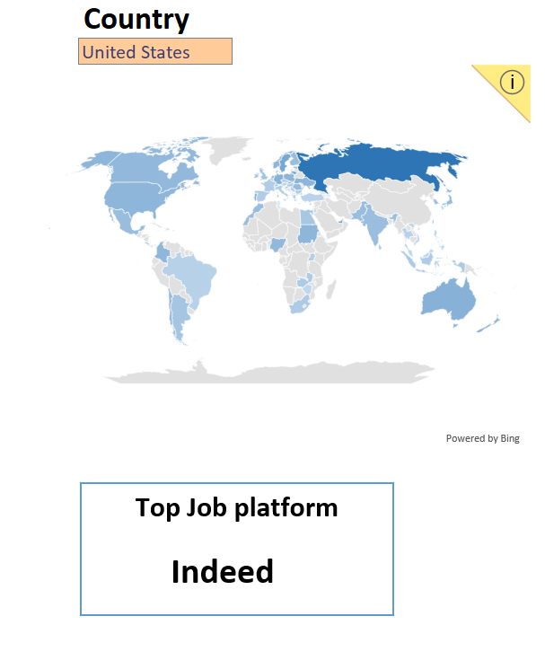
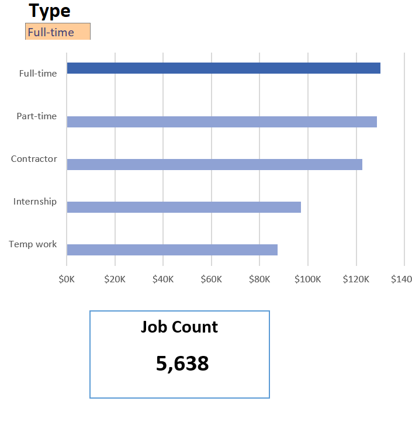

# 📊 Excel Salary Dasboard  
*This data jobs salary dashboard was created to help job seekers investigate salaries for their desired jobs and ensure they are being adequately compensated.*  

---

## 📌 **Table of Contents**

1. [Description](#-description)  
2. [Features](#-features)  
3. [Installation](#-installation)  
4. [Formulas and Functions](#-formulas-and-functions)  
   - [Median Salary by Job Titles](#-median-salary-by-job-titles)  
   - [Dashboard Implementation](#-dashboard-implementation)  
5. [Data Validation](#-data-validation)  
   - [Filtered List for Data Validation](#-filtered-list-for-data-validation)  
6. [Usage](#-usage)  
7. [Screenshots](#-screenshots)  
8. [Conclusion](#-conclusion)  
9. [Contributing](#-contributing)     

---

## 📝 Description  
What your project does and its purpose:  
> *"This Excel workbook helps job seekers investigate salaries for their desired jobs in data science. It helps data science job seekers look up jobs by location, job titles, skills and salaries"*  

**Key Highlights:**  
- ✅ No manual calculations needed.  
- ✅ Compatible with Excel 2016+ and Office 365.  

---

## ✨ Features  
- **Dynamic Dashboards**: Auto-updating charts/graphs.   
- **Data Validation**: Dropdowns/error-checking for inputs.
- **Formulas and Functions** — To perform salary analysis. 
- **Excel Features**: Utilized Excel's map chart feature to plot median salaries globally, utilized bar chart feature (with formatted salary values) and optimized layout for clarity.  

---

## ⚙️ Installation  
1. Download the file:  
   - Click `Code Button` in the [Repo](https://github.com/Mark-crypto/Excel_Salary_Dashboard_Project) section.  
2. Open in **Excel Desktop** (some features may not work in Excel Online).  

---

## 🧮 Formulas and Functions

### 💰 Median Salary by Job Titles

```excel
=MEDIAN(
  IF(
    (jobs[job_title_short]=A2)*
    (jobs[job_country]=country)*
    (ISNUMBER(SEARCH(type,jobs[job_schedule_type])))*  
    (jobs[salary_year_avg]<>0),
    jobs[salary_year_avg]
  )
)
```

- 🔍 **Multi-Criteria Filtering**:  
  - Filters job title, country, and schedule type, excluding blank salaries.  
- 📊 **Array Formula**:  
  - Uses **MEDIAN()** function with nested **IF()** for dynamic analysis.  
- 🎯 **Tailored Insights**:  
  - Provides salary info specific to job title, region, and type.  
- 🔢 **Formula Purpose**:  
  - Populates a table with the median salary based on selected criteria.  

---

### 📉 Dashboard Implementation

- ⏰ **Count of Job Schedule Type**  
```excel
=FILTER(J2#,(NOT(ISNUMBER(SEARCH("and",J2#))+ISNUMBER(SEARCH(",",J2#))))*(J2#<>0))
```

- 🔍 **Unique List Generation**:  
  - Uses **FILTER()** function to exclude "and" or commas and omit zero values.  
- 🔢 **Formula Purpose**:  
  - Populates a list of unique job schedule types.  

---

## ❎ Data Validation

### 🔍 Filtered List for Data Validation

- 🔒 **Enhanced Data Validation**:  
  - Implements filtered list under **Job Title**, **Country**, and **Type**.  
- 🎯 **Benefits**:  
  - Restricts user input to predefined, validated schedule types.  
  - Prevents incorrect or inconsistent entries.  
  - Enhances usability and data accuracy.  

---

## 📊 Usage  
**Step-by-Step:**  
1. Select the job country, job title or job type from the `Salary_Calculator_Sheet`.  
2. Wait for the charts to sort based on your search.  
3. View results in `Salary_Calculator_Sheet`.  

---

## 🖼️ Screenshots  
| Chart Title | Chart  |  
|---------------|-----------------|  
| **Job Title** ||
| **Country** ||
|**Job Type**||
   
---

## 🏁 Conclusion
This dashboard provides insights into salary trends across various **data-related job titles**. It helps users make informed decisions regarding their career paths. It offers a deeper understanding of how **location** and **job type** influence salaries.  

✅ Feel free to explore the dashboard and gain insights to make better career decisions!


## 🤝 Contributing  
Contributions welcome!  
- Report bugs via [Issues](https://github.com/Mark-crypto/Excel_Salary_Dashboard_Project/issues).  
- Suggest features or submit PRs.  

---
 


